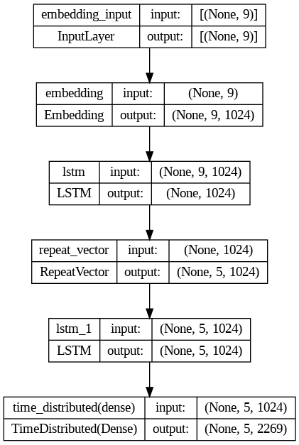
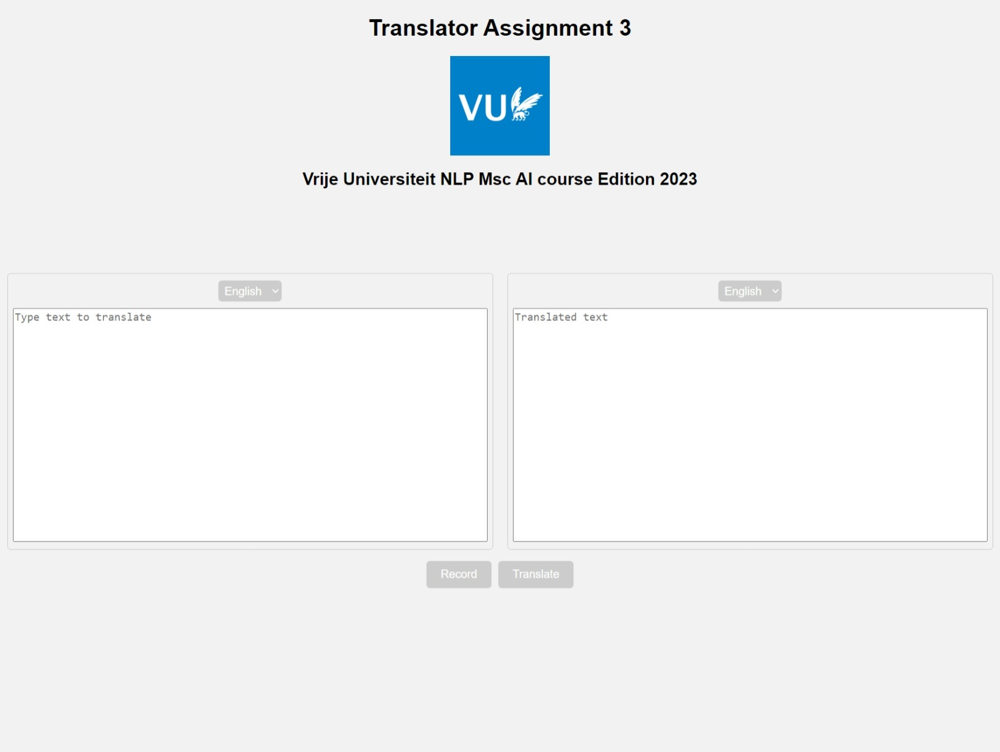

# Translation App

This is a simple translation app that uses a neural machine translation model to translate text or speech from English to Spanish and vice versa. The app is designed to run locally on your computer after you clone the repository and install the necessary dependencies.

## Model Architecture

The model used in this app is a neural machine translation model that consists of an encoder and a decoder. The encoder is a Long Short-Term Memory (LSTM) network that processes the input sequence and produces a fixed-length representation of it. The decoder is another LSTM network that takes the encoder's output as input and generates the output sequence. The model architecture is shown below:




The data used in this application is from the Tatoeba Project, which can be downloaded from [datasets](http://www.manythings.org/anki/)

## Installation

To install the app, you should first clone the repository to your local machine. Then, navigate to the app directory and create a conda environment using the provided environment.yml file:

```bash
conda env create -f environment.yml
```

This will create a new environment called machine_translation. To activate the environment, run: 

```bash
conda activate machine_translation
```

# Running the App

To run the app, you need to activate the translator environment and navigate to the app directory. Then, run the translator.py script:

```bash
cd app && python translator.py
```

This will start a web server on your local machine that you can access using your web browser at http://localhost:5000. The web page looks like this:



To translate a text, simply type the text in the input box and click on the Translate button. To translate a speech, click on the Record button and speak your sentence. The app will automatically recognize your speech and translate it.

Please note that the translation quality of the model is not perfect and there might be some errors in the translations. The model currently only supports English and Spanish languages.

# Acknowledgments

This app was developed as an assignment for the NLP course of the MSc AI program at Vrije Universiteit Amsterdam, edition 2023. The neural machine translation model used in the app follows the tutorial found at: [Tutorial website](https://machinelearningmastery.com/develop-neural-machine-translation-system-keras/)